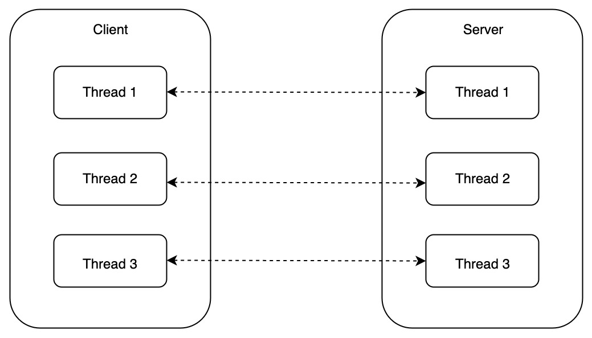
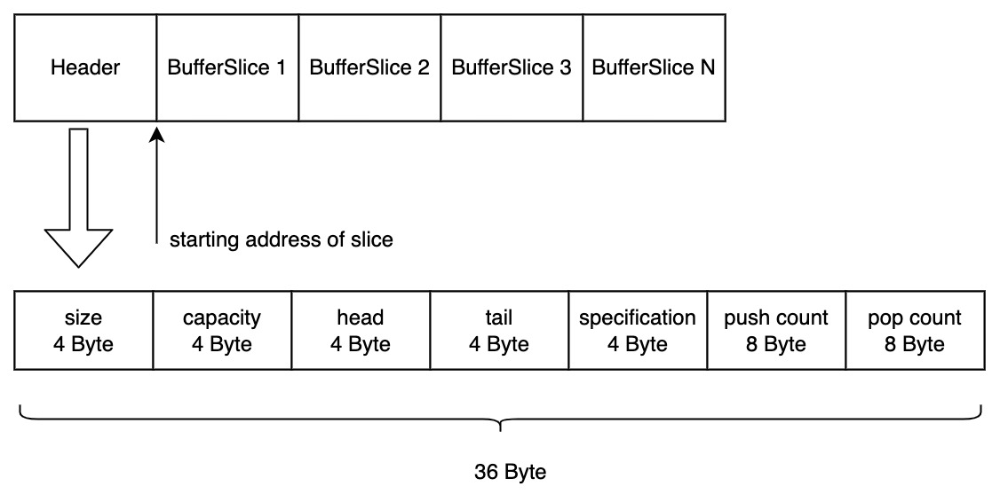
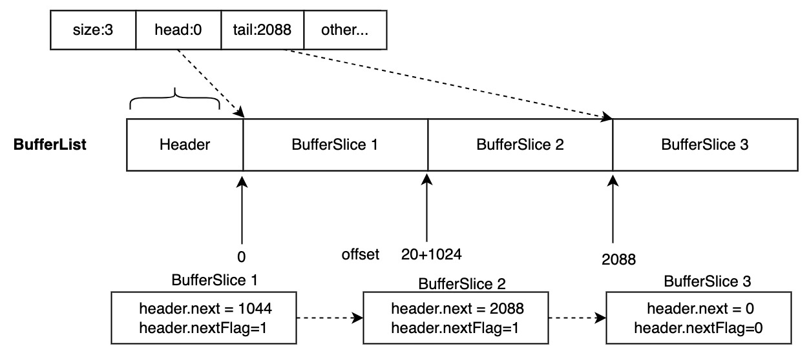
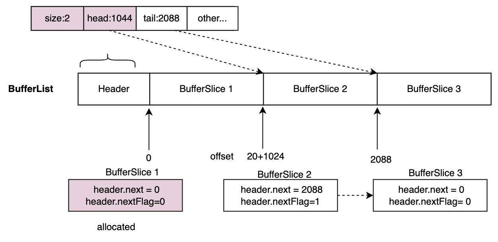
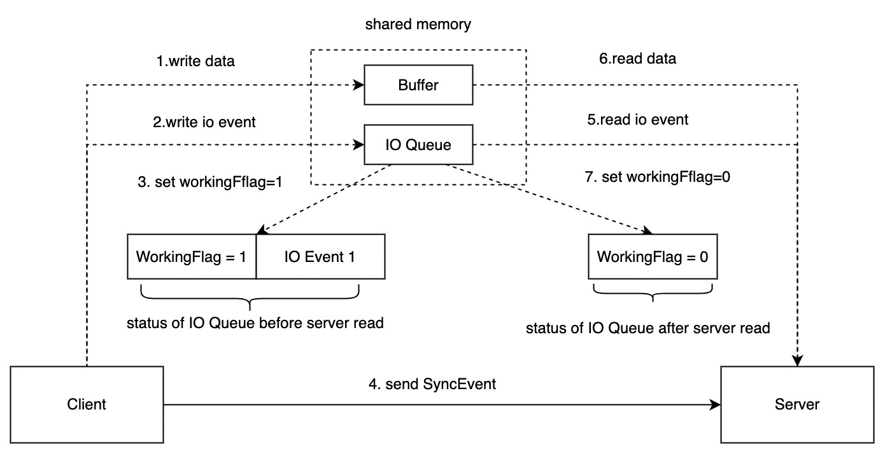
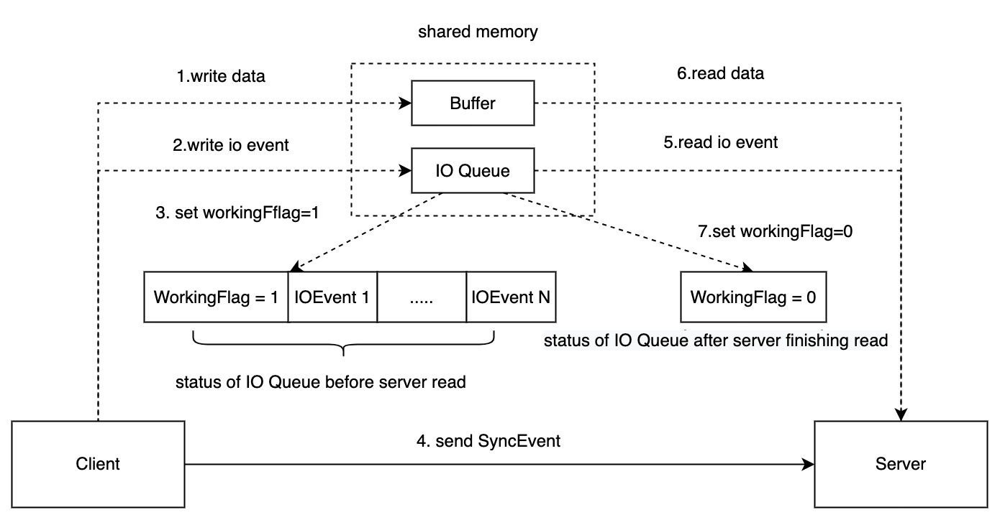

# Shmipc-spec
English | [中文](README_CN.md)
## 1 Overview

Shared memory is the fastest inter-process communication (IPC) method in Linux, but it does not define how processes communicating through shared memory synchronize, or how shared memory is managed. There is not much information in the open source community about this. This article defines a process synchronization mechanism, shared memory management mechanism, error fallback mechanism, and other aspects from a performance perspective, forming a high-performance IPC solution that is suitable for production environments based on shared memory IPC.

## 2 Communication model 

### 2.1 Definition

1. The process that initiates communication is defined as the Client process.
2. The process that receives communication passively is defined as the Server process.
<html>
<body>
    
</body>
</html>

As shown in the above figure, when the Client process and the Server process communicate for the first time, they need to establish a TCP connection or a Unix Domain Socket connection, and then complete the protocol initialization through this connection. The initialization involves processes such as initialization and mapping of shared memory. After initialization is complete, full-duplex communication can be achieved through shared memory.

### 2.2 Multi-process

The relationship between the Client process and the Server process is N:N. A Client process can connect to multiple Server processes, and a Server process can also connect to multiple Client processes.

<html>
<body>
    
</body>
</html>

### 2.3 Single process and multi-thread

The multiple threads of Client processes and Server processes can also have an N:N relationship.

<html>
<body>
    
</body>
</html>

## 三、Communication protocol

The communication protocol defines the message format transmitted over TCP connections or Unix Domain Socket connections.

### 3.1 Message format

The definition of a message passed between a Client process and a Server process over a connection is as follows:

<html>
<body>
    
</body>
</html>

| field    | length   | explanation                                             |
| --------- | -------- | -------------------------------------------------- |
| length  | 4 byte | Total length of the message, including the header.                       |
| magic   | 2 byte | The Magic number is used to identify the protocol itself and is fixed as 0x7758.   |
| version | 1 byte | The Protocol version number is used for subsequent iterative updates.                   |
| type    | 1 byte | Message type                                         |
| payload | Customization | The message body is defined by the message type, and its length and format are customizable. |

### 3.2 Message Type

| type                   | explanation                                                                              |
| ----------------------- | ----------------------------------------------------------------------------------- |
| ExchangeMetadata      | Protocol negotiation involves exchanging metadata, which includes the list of currently supported features. For more details, please refer to Chapter 4: Protocol Initialization. |
| ShareMemoryByFilePath | Shared memory is mapped through file path mapping. For more details, please refer to Chapter 4: Protocol Initialization.                            |
| ShareMemoryByMemfd    | Shared memory is mapped through mmefd. For more details, please refer to Chapter 4: Protocol Initialization.                               |
| AckReadyRecvFD        | Prepared to receive memfd, please refer to chapter 4: Protocol Initialization for details.                                           |
| AckShareMemory        | Shared memory mapping is completed. For more details, please refer to Chapter 4: Protocol Initialization.                                        |
| SyncEvent             | Synchronization events are used to notify the other process to handle new data. For more details, please refer to Section 6.1: Process Synchronization.                   |
| FallbackData          | When shared memory is insufficient, data is sent through the connection. For more details, please refer to Chapter 7: Error Recovery.                         |
| HotRestart            | Hot upgrade. For more details, please refer to Chapter 8: Hot Upgrade.                                                      |
| HotRestartAck         | Hot upgrade is completed. For more details, please refer to Chapter 8: Hot Upgrade.                                              |

**Message payload**

about the `u16str`’s encoding format is  `string length 2 Byte | string body`

| Type                  | payload                                                                                                                                    |
| ----------------------- | ------------------------------------------------------------------------------------------------|
| ExchangeMetadata      | The payload for metadata uses the JSON format, which provides sufficient extensibility.
| ShareMemoryByFilePath | Queue path (u16str) | Buffer path (u16str)                                                                                                   |
| ShareMemoryByMemfd    | Queue path (u16str) | Buffer path (u16str)                                                                                                   |
| AckReadyRecvFD        | empty                                                                                                                                         |
| AckShareMemory        | empty                                                                                                                                         |
| FallbackData          | Metadata 8 byte | payload                                                                                                                  |
| SyncEvent             | empty                                                                                                                                         |
| HotRestart            | The behavior of hot upgrade is related to the programming interface and is not constrained at the protocol layer.|
| HotRestartAck         | empty                                                                                                                                         |

The current defined feature list

1. Memfd, a feature supported only after Linux 3.17.
2. HotRestart, which includes whether the Server supports hot upgrade and whether the Client supports handling hot upgrade events from the Server.

## 4 Protocol Initialization

<html>
<body>
    
</body>
</html>

Protocol initialization mainly completes the connection between the Client and the Server, and then maps shared memory through this connection, which includes three parts.
- Establishing a connection.
	- The Server listens on a socket address, localhost : $PORT, or a Unix Domain Socket.
	- The Client connects to this address and obtains a connection for subsequent message exchange.
- Protocol negotiation. Corresponds to steps 1~2 in the above figure.
	 - The Client sends an ExchangeMetadata message to inform the Server of the current metadata of the Client.
	- If the Server does not support the Client's protocol version, the Server closes the connection.
	- If the Server can support the Client's protocol version, it replies with an ExchangeMetadata message and carries the metadata of the Server.
	- After the Client receives the ExchangeMetadata message from the Server, if it can support the Server's protocol version, it proceeds to the next step; otherwise, it closes the connection.
- Shared memory mapping, corresponds to steps 3~6 in the above figure.
	- Through protocol version negotiation, the Client can obtain the Server's feature list. Assuming that shared memory is mapped through Memfd, the Client sends a ShareMemoryByMemfd message to the Server.
	- After the Server receives the ShareMemoryByMemfd message, it replies with an AckRecvMemFd message, indicating that it is ready to receive the memfd.
	- The Client sends the memfd to the Server through Unix Domain Socket (TCP connection does not support sending and receiving file descriptors).
	- After the Server completes the shared memory mapping, it replies with an AckShareMemory message.
	- If the Client maps shared memory through a file (ShareMemoryByFile), then steps 4~5 in the above figure are not necessary.

## 5 Shared memory management

Shared memory is created and initialized by the Client process, and is shared with the Server process through a connection. The subsequent management involves three issues:

1. Allocation: Where should the data sender write the data into the shared memory?
2. Reclamation: After using the data, how should the data receiver recycle the shared memory?
3. Cleaning: How should the mapped memory area be cleaned up after the process exits?

This chapter describes a simple and efficient mechanism that achieves allocation, reclamation, and cleaning of shared memory across processes with an O(1) algorithm complexity. The core idea is to divide the continuous shared memory area into multiple slices and organize them in the form of a linked list. Allocation is done from the head of the list, and reclamation is done to the tail of the list.

### 5.1 Data structure.

**BufferManager**

The BufferManager is a continuous shared memory area that contains a Header and multiple BufferLists. Each BufferList contains multiple continuous fixed-length buffers.

<html>
<body>
    
</body>
</html>

| field          | explanation                                                                              |
| --------------- | ----------------------------------------------------------------------------------- |
| List size     | Indicates how many BufferLists the BufferManager is managing.|
| Version       | The version number of the data structure, which is used to identify the layout of the data structure itself in shared memory. Different versions may have different layouts.|
| Remain length |Indicates how much shared memory is remaining after accounting for the 8-byte Header.|

**BufferList**

<html>
<body>
    
</body>
</html>

| Field         | Explanation                                                             |
| --------------- | ------------------------------------------------------------------ |
| size          | The number of free, unallocated BufferSlice instances in the BufferList.|
| capacity      | The maximum number of BufferSlice instances that the BufferList can hold.|
| head          | The offset of the head node relative to the start address in shared memory, which is used to allocate BufferSlice |
| tail          | The offset of the tail node relative to the start address in shared memory, which is used to reclaim BufferSlice. |
| specification | The capacity of each BufferSlice, in bytes.                              |
| push count    | A counter for the total number of times that BufferSlice instances have been reclaimed in the BufferList, used for monitoring. |
| pop count     | A counter for the total number of times that BufferSlice instances have been allocated in the BufferList, used for monitoring.|

**BufferSlice**
<html>
<body>
    
</body>
</html>

| Field     | Explanation                                                                                                                                                     |
| ----------| --------------------------------------------------------------------------------------------------------------------------------------------------------------|
| `data`    | The actual data contained within the `BufferSlice`.                                                                                                           |
| `capacity`| The maximum amount of data that can be contained within the `data` field, in bytes.                                                                            |
| `start`   | The offset from the start of the `BufferSlice` to the first byte of data.                                                                                      |
| `next`    | A pointer to the next `BufferSlice` in the linked list, as an offset from the start of the `BufferManager` in shared memory.                                      |
| `flags`   | A two-byte field containing 16 individual flags. The first flag is `nextFlag`, which indicates whether the `next` field is valid. The second flag is `freeFlag`, which indicates whether the `BufferSlice` has been allocated. |
| `unused`  | Two unused bytes that are not currently defined.                                                                                                               |
                                                                                                                                  

By mapping a continuous shared memory region, we can obtain three data structures: BufferManager, BufferList, and BufferSlice. With BufferList, we can easily allocate and recycle shared memory across processes.

### 5.2 Allocation and recycle

Starting from an example, let's understand the process of allocating and recycling about BufferSlice.

Assumption: There are three slices in the BufferList, and each slice has a capacity of 1 KB.

**Before allocation**

In the BufferListHeader, head points to the first BufferSlice in the list, tail points to the last BufferSlice (BufferSlice 3), and size is 3.

<html>
<body>
    
</body>
</html>

**After allocation**

At this point, in the BufferListHeader, head points to the second BufferSlice in the list, tail points to the last BufferSlice (BufferSlice 3), and size is now 2. BufferSlice 1 has been allocated and is no longer pointing to BufferSlice 2.

<html>
<body>
    
</body>
</html>

**After recycle**

At this point, in the BufferListHeader, head points to the second BufferSlice in the list, tail points to the first BufferSlice (BufferSlice 1), and size is now 3. BufferSlice 3 now points to BufferSlice 1, which has been recycled.

<html>
<body>
    
</body>
</html>

**Regarding race conditions:**

- When the number of BufferSlices in the BufferList is greater than 1, allocation and recycle will operate on different BufferSlices and will not interfere with each other. However, concurrent allocation or recycle will result in race conditions.
	- Allocation operation needs to use a CAS (Compare and Swap) operation on head in the BufferListHeader to avoid concurrent conflicts.
	- Deallocation operation needs to use a CAS operation on tail in the BufferListHeader to avoid concurrent conflicts.
- When the number of BufferSlices in the BufferList is equal to 1, allocation and recycle operations will operate on the same BufferSlice simultaneously in concurrent situations, causing conflicts. In this case, allocation operations are prohibited.
- When operating on size in the BufferListHeader, atomic APIs provided by programming languages must be used to ensure atomicity.

**Algorithm complexity**

Assuming there are N BufferSlices, the algorithm complexity of allocation and recycling operations is O(1) in itself, and even if there are concurrent conflicts, the probability of occurrence is very low. Every occurrence of concurrent conflict requires one CAS (Compare and Swap) operation. The maximum number of CAS operations (conflict times) that occur during one allocation or recycling operation is approximately equal to the number of BufferSlices, which is O(N).

### 5.3 Cleanup

After a process exits, the cleanup of shared memory depends on the way the shared memory was initially mapped.

1. When using mmap with files, the shared memory's lifetime is tied to the kernel rather than the process. If a process crashes, there is no opportunity for stateless applications to unmap the shared memory, and a third-party process is needed for cleanup. However, in general, third-party processes are only needed to assist when the IPC process group crashes simultaneously. Otherwise, when one process crashes, another process will receive a connection-closed event and can unmap the shared memory using unmap.
2. When using mmap with memfd, the shared memory's lifetime is tied to the process, and the OS will clean up after the process exits.

## 6 Process synchronization

The client and server processes require some form of synchronization mechanism to ensure that when one party writes data, the other party can receive a notification and process it. This chapter will describe an efficient synchronization mechanism that can reduce latency and improve performance in the face of high-concurrency requests. For low-frequency requests, it will not introduce incremental delay.

### 6.1 Notification

The connection established between the client and server is used to send SyncEvent (defined in section 3.2) for inter-process notification. When the sending party writes data to shared memory, it notifies the other party to process it via SyncEvent.

### 6.2 IO Queue

The IO queue is a data structure mapped in shared memory used to describe the position and other metadata of IPC data in shared memory for easy reading by the other party.

<html>
<body>
    
</body>
</html>

QueueHeader is used to describe and maintain the IO queue.

| Field     | Explanation                                                |
| --------- | ---------------------------------------------------------- |
| capacity  | Maximum number of Events that the IO queue can hold        |
| head/tail | Monotonically increasing, used to maintain dequeue/enqueue |
| flags     | Each flag is 1 bit, currently only the Working flag is defined, which is described in detail in section 6.4. |

Event is used to describe the data for IPC communication.

- offset. The starting address of the data in the first BufferSlice in shared memory. The BufferSlice chain is self-describing in shared memory, so the other process only needs 4 bytes of offset to find all the data it needs to read in shared memory.  
- reverve. 8 bytes are reserved for customization and can be used in implementation when building programming interfaces. For example, if you want to build a "virtual connection" that has POSIX socket semantics, which does not occupy any OS resources, you can define a 4-byte ID to identify the data on different "virtual connections", and another 4 bytes to describe the state of the "virtual connection" (open or closed, etc.). So, ID=1, offset=1024, status=1 can be used to describe that data has been written on the "virtual connection" with ID 1 at the shared memory offset 1024, and the "virtual connection" is in the open state (status=1). ID=1, offset=0, status=0 can be used to describe that the "virtual connection" with ID 1 is closed and no more data will be written.

### 6.3 Communication

Sections 6.1 and 6.2 have described how to read data from shared memory and event notification between processes. This section describes the process of one-time communication.

<html>
<body>
    
</body>
</html>

1. The client writes data to shared memory and obtains the offset of the first BufferSlice relative to shared memory.
2. The client wraps the offset into an IO event and writes it to the IO Queue.
3. The client sets the workingFlag of the IO queue to 1.
4. The client sends a SyncEvent to the server.
5. The server is awakened upon receiving the SyncEvent and reads the IO Queue to obtain the offset.
6. The server reads the data from shared memory based on the offset.
7. At this point, the IO Queue is empty, and the server sets the workingFlag to 0.

The process of the server replying to the client's data is similar to the above process, with the only difference being that the IO Queue is isolated. For the client, the SendQueue is equivalent to the Server's ReceiveQueue, and the Server's SendQueue is equivalent to the Client's ReceiveQueue.

### 6.4 Batch harvesting IO

<html>
<body>
    
</body>
</html>

In a concurrent online scenario, the client may initiate multiple requests, where each request corresponds to an IO Event. The first request sets the workingFlag to 1 and sends a SyncEvent. Before the server processes the IO Queue, all subsequent requests sent by the client can be aware that the server is processing the IOEvent through the workingFlag set to 1, so they do not need to send a SyncEvent to notify the server.

In this way, we can implement a batch harvesting IO operation with a single SyncEvent.

## 7 Fallback

This chapter describes how to handle the scenario where there is not enough shared memory available.

### 7.1 shared memory is exhausted

<html>
<body>
    
</body>
</html>

When the shared memory is depleted, new data is no longer communicated through shared memory. Instead, the established connection between Client and Server can be used via TCP loopback or Unix Domain Socket. Due to the limited socket buffer of a single connection, it can also provide backpressure to alleviate the pressure on the Server.

1. Set the type in the message header to FallbackData.
2. FallbackDataHeader is a reserved 8 bytes for describing the metadata of the payload, similar to the 8 bytes reserved in the IO event. For example, it can be used to describe the ID and status of a virtual connection.
3. The payload is the actual transmitted data.

### 7.2 IO is full

When the IO queue is full, it means that the server is under high pressure. At this time, the client will be blocked until there is available space in the IO queue. This is similar to backpressure, which is similar to when the Unix socket buffer is full, and the write operation will either fail (EAGAIN) or block. It is not advisable to introduce too many operations to increase complexity.

## 8 Hot restart

Hot upgrade refers to updating the server process code without affecting the client's ability to write data. There are many options for hot upgrade technologies. Considering that IPC provides services in the form of a library embedded in the application process, a simple application-level hot upgrade can be chosen.

<html>
<body>
    
</body>
</html>

1. After the New Server completes startup, it connects to the Old Server and sends a HotRestart message.
2. Upon receiving the HotRestart message, the Old Server sends a HotRestart message to all Clients.
3. After receiving the HotRestart message, the Client connects to the New Server, completes protocol initialization, and sends new requests to the New Server.
4. After the dependency between the Client and Old Server is removed, the Client sends a HotRestartAck message to the Old Server. The dependencies between the Client and Old Server are related to the programming interface provided by the protocol and are not constrained here. For example, as mentioned in Chapter 6.2, the concept of "virtual connection" is introduced, so the "dependency removal" here means that all virtual connections between the Client and Old Server are closed and no new virtual connections will be established.
5. After all Clients connected to the Old Server have replied with HotRestartAck, the Old Server sends a HotRestartAck message to the New Server, and finally exits, completing the hot upgrade process.

## 9 Some Design Considerations

**On the Choice of Process Synchronization Mechanism**

In Linux production environments, high-performance process synchronization mechanisms such as TCP loopback, Unix domain socket, and event fd are commonly used. The performance of event fd benchmark is slightly better, but passing fd across processes will introduce too much complexity, and its performance improvement on IPC is not significant. Therefore, reusing the connection established between the client and the server will reduce complexity and can also be used on systems without event fd.

In addition, this solution is suitable for online scenarios that have relatively high real-time requirements. For offline scenarios, using high-interval sleep and polling the IO queue is also a good choice, but be aware that sleep itself requires system calls and has higher overhead than sending SyncEvent through the connection.

**About fallback**

Perhaps it is possible to alleviate the problem of insufficient shared memory by dynamically adding mapped shared memory expectations at runtime, but it will bring more complexity to management. The workload of an application scenario is relatively fixed, and now computer memory resources are no longer scarce, so a relatively large block of shared memory can be allocated at the beginning for subsequent use. The size of the shared memory buffer is somewhat similar to the unix socket buffer. When it is filled, it means that the server is overloaded and cannot handle and release it in time, and it needs to be buffered. At this time, allocating more shared memory is useless.

**About hot upgrade**

Server hot upgrade has a standard listener fd hot migration plan, but it emphasizes lossless and imperceptible. However, shared memory communication provides services through lib, which has been embedded in the application. Performing hot upgrade at the application layer is much simpler compared to listener fd hot migration.

**Why need IO queue**

The IO queue is mainly introduced for batch harvesting of IO, avoiding frequent sending and receiving of SyncEvent on the connection, and the impact of this process on performance cannot be ignored.

