# Shmipc规范

[English](README.md) | 中文
## 一、概述

共享内存是 Linux 下最快的进程间通讯（IPC）方式，但其没有定义 IPC 的进程如何进行同步，以及对共享内存如何进行管理等。开源社区关于这方面的资料不多，本文从性能的角度出发，定义了基于共享内存 IPC 的进程同步机制、共享内存管理机制、错误回退机制等，形成一套生产环境下可用的高性能 IPC 方案。

## 二、通讯模型

### 2.1 定义

1. 主动发起通讯的进程定义为 Client 进程。
2. 被动接收通讯的进程定义为 Server 进程。
<html>
<body>
    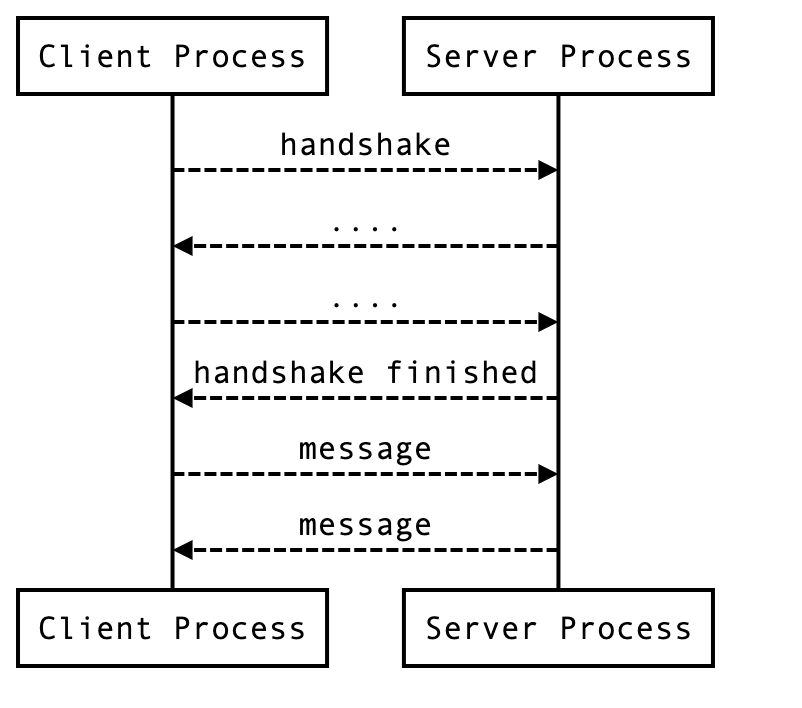
</body>
</html>

如上图所示，Client 进程和 Server 进程第一次通讯时需要建立 TCP 连接或是 Unix Domain Socket 连接，然后通过该连接完成协议初始化。初始化涉及共享内存的初始化和映射等过程，初始化完成之后可以通过共享内存进行全双工通讯。

### 2.2 多进程

Client 进程和 Server 进程是 N : N 的关系。一个 Client 进程可以和多个 Server 进程进行连接。一个 Server 进程也可以和多个 Client 进程进行连接。

<html>
<body>
    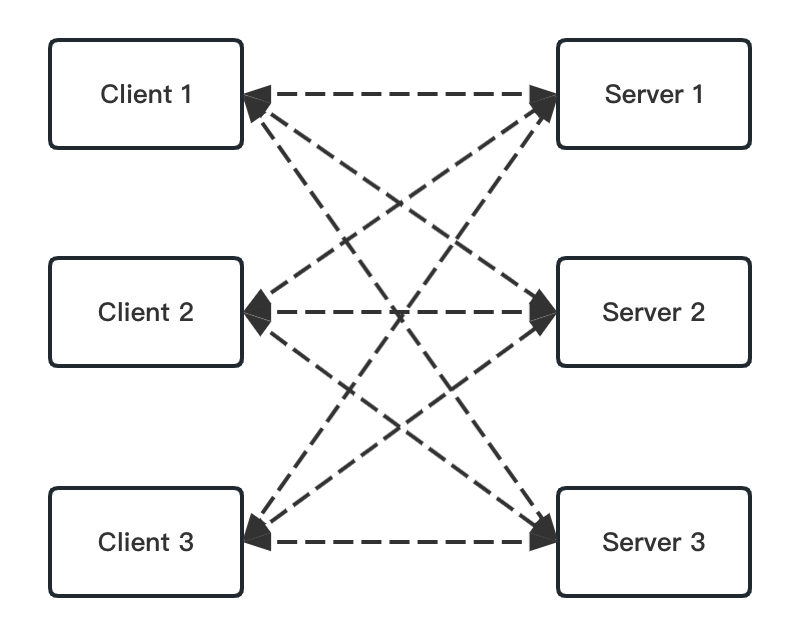
</body>
</html>

### 2.3 单进程-多线程

Client 进程和 Server 进程的多个线程也可以是 N : N 的关系。

<html>
<body>
    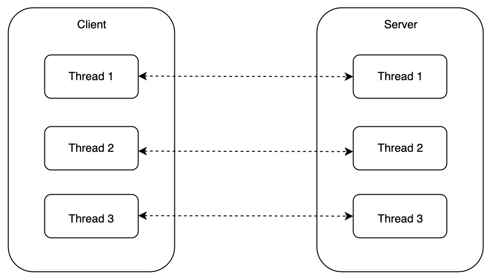
</body>
</html>

## 三、通信协议

通讯协议定义了 TCP 连接或 Unix Domain Socket 连接所传递的消息格式。

### 3.1 消息格式

Client 进程和 Server 进程在连接上所传递的一条消息定义如下：

```
+---------------+--------------+--------------+-------------+---------------+
| 4 Byte length | 2 Byte magic | 1 Byte version | 1 Byte type |    payload  |
+---------------+--------------+--------------+-------------+---------------+
|<---------------------- Header --------------------------->|
|<------------------------------ Message ---------------------------------->|
```

| 字段    | 大小   | 解释                                             |
| --------- | -------- | -------------------------------------------------- |
| length  | 4 byte | 消息总长度，包含 Header。                        |
| magic   | 2 byte | Magic number 用于标识协议本身，固定为 0x7758。   |
| version | 1 byte | 协议版本号，用于后续迭代更新。                   |
| type    | 1 byte | 消息类型                                         |
| payload | 自定义 | 消息体，由消息类型定义消息体，长度和格式自定义。 |

### 3.2 消息类型

| 类型                  | 解释                                                                              |
| ----------------------- | ----------------------------------------------------------------------------------- |
| ExchangeMetadata      | 协议协商，交换元信息，元信息包括当前支持的 feature 列表。详见章节四：协议初始化。 |
| VersionExchange      | 协议协商，交换版本信息，主要是生产环境中协议演进时为了兼容性，需要加入此协商。 |
| ShareMemoryByFilePath | 通过文件路径映射共享内存，详见章节四：协议初始化。                                |
| ShareMemoryByMemfd    | 通过 mmefd 映射共享内存，详见章节四：协议初始化。                                 |
| AckReadyRecvFD        | 已做好准备接收 memfd，详见章节四：协议初始化。                                            |
| AckShareMemory        | 完成共享内存映射，详见章节四：协议初始化。                                        |
| SyncEvent             | 同步事件，用于通知对端进程处理新数据。详见章节6.1：进程同步。                     |
| FallbackData          | 共享内存不足时，通过连接发送数据。详见章节七：错误回退。                          |
| HotRestart            | 热升级，详见章节八：热升级。                                                      |
| HotRestartAck         | 热升级完成，详见章节八：热升级。                                                  |

**消息payload**

u16str 编码格式： string length 2 Byte | string body

| 类型                  | payload                                                                                                                                    |
| ----------------------- | ------------------------------------------------------------------------------------------------|
| ExchangeMetadata      | payload 为元信息，格式参考4.2章节。 |
| VersionExchange | 空
| ShareMemoryByFilePath | QueuePath (u16str) | BufferPath (u16str)                                                                                                   |
| ShareMemoryByMemfd    | QueuePath (u16str) | BufferPath (u16str)                                                                                                   |
| AckReadyRecvFD        | 空                                                                                                                                         |
| AckShareMemory        | 空                                                                                                                                         |
| FallbackData          | Metadata 8 byte | payload                                                                                                                  |
| SyncEvent             | 空                                                                                                                                         |
| HotRestart            | 与协议上层编程接口相关，不做约定                                                                                                           |
| HotRestartAck         | 空                                                                                                                                         |

当前定义的 feature list:

1. Memfd，Linux 3.17之后才支持的 feature。
2. HotRestart，Server 是否支持热升级以及 Client 是否支持处理 Server 的热升级事件。

## 四、协议初始化


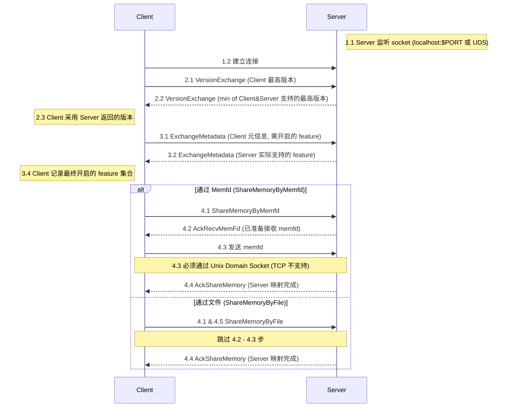

### 4.1 初始化流程
协议初始化主要完成 Client 和 Server 的连接，然后通过该连接映射共享内存，包含三个部分。

1. 建立连接
   1. Server 监听一个 socekt 地址，`localhost:$PORT` 或 Unix Domain Socket
   2. Client 连接该地址，得到一个连接，用于后续交换消息。
2. 版本协商
   1. Client 发送 VersionExchange Server 当前 Client 的最高版本。
   2. Server 回复自己能支持的最高版本和 Client 的发来的版本中小的那个。
   3. Client 收到 Server 返回的 VersionExchange 后，采用该版本。
3. Metadata协商
   1. Client 发送 ExchangeMetadata，告知 Server 当前 Client 的元信息，比如需要开启的 feature。
   2. Server 比对 Client 需要开启的 feature，并根据自身情况将不支持的 feature 去掉，返回ExchangeMetadata。
   4. Client 收到 Server 返回的 ExchangeMetadata 后记录最终开启的 feature 集合。
4. 映射共享内存
   1. 通过协议版本协商，Client 能够拿到 Server 的 Feature list。假设通过 Memfd 映射共享内存，Client 发送 ShareMemoryByMemfd 消息给 Server。
   2. Server 收到 **ShareMemoryByMemfd** 后，回复 AckRecvMemFd。表示当前已做好准备接收memfd
   3. Client 通过 Unix Domain Socket 发送 memfd 至 Server 。( TCP 连接不支持收发 fd )
   4. Server 完成共享内存的映射后，回复  **AckShareMemory** 。
   5. 如果 Client 是通过文件的形式 **（ShareMemoryByFile）** 来映射共享内存，则没有2~3步。

### 4.2 ExchangeMetadata 格式

该功能非必须，只是提供一种可扩展性。
可以通过交换Metadata来确认最终开启的feature，因为有可能某些feature是需要两边配合的，比如是否通过定时polling而不是uds发送事件通知唤醒对端。

| 字段    | 大小   | 解释                                             |
| --------- | -------- | -------------------------------------------------- |
| feature size  | 4 byte | 后续包含多少个feature ，后续每个feature格式定义如下                       |

每个feature的格式
| 字段    | 大小   | 解释                                             |
| --------- | -------- | -------------------------------------------------- |
| feature id   | 2 byte | feature标识的唯一id，新增feature必须和之前的feature id不重复   |
| enabled | 2 byte | 是否开启。client发送时填写为1，但是server返回时可以改为0。如果enabled为0，后续feature config length不管为多少（可以为0），都应该跳过。                  |
| feature config length    | 4 byte | 每个feature的配置的长度，如果server不认识，可以据此跳过。如果没有具体配置项或者前面enabled=0，length可以为0。                                      |
| feature config payload | 自定义 | 每个feature的配置定义（如有），具体的格式可以由具体的实现方自行决定。下文会列出默认实现的一些feature列表 |

### 4.3 feature列表

#### 4.3.1 event queue polling，（feature id=1）

通过定时polling 事件队列而不是uds发送事件通知唤醒对端，feature config

| 字段    | 大小   | 解释                                             |
| --------- | -------- | -------------------------------------------------- |
| polling interval us | 4 byte | polling的间隔，单位是us |

## 五、共享内存管理

共享内存由 Client 进程创建并初始化，通过连接 Server 进程完成共享。其后的管理涉及三个问题：

1. 分配，数据发送方应把数据写入共享内存的哪儿？
2. 回收，数据接收方从共享内存读取数据，使用完成后应该怎么回收？
3. 清理，进程退出后，已映射的内存区域如何清理？

本章将描述了一种简单高效的机制，以 O(1) 的算法复杂度，完成跨进程共享内存的分配、回收、清理。核心思想是：将连续的共享内存区域划分为多个切片，以链表的形式组织切片。从链头分配，回收至链尾。

### 5.1 数据结构

**BufferManager**

BufferManager是一片连续的共享内存区域，BufferManager 包含一个 Header 和若干个 BufferList。每个 BufferList 包含若干个连续的固定长度的 buffer。

<html>
<body>
    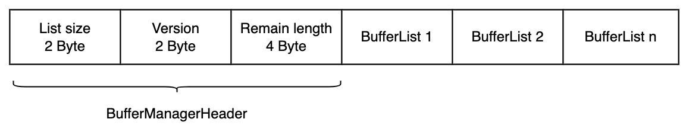
</body>
</html>

| 字段          | 解释                                                                              |
| --------------- | ----------------------------------------------------------------------------------- |
| List size     | 表示 BufferManager 管理着多少个 BufferList                                        |
| Version       | 数据结构的版本号，用于标识数据结构本身在共享内存中的布局。不同 version 的布局不同 |
| Remain length | 除掉8字节的 Header，剩余的共享内存还有多少                                        |

**BufferList**

<html>
<body>
    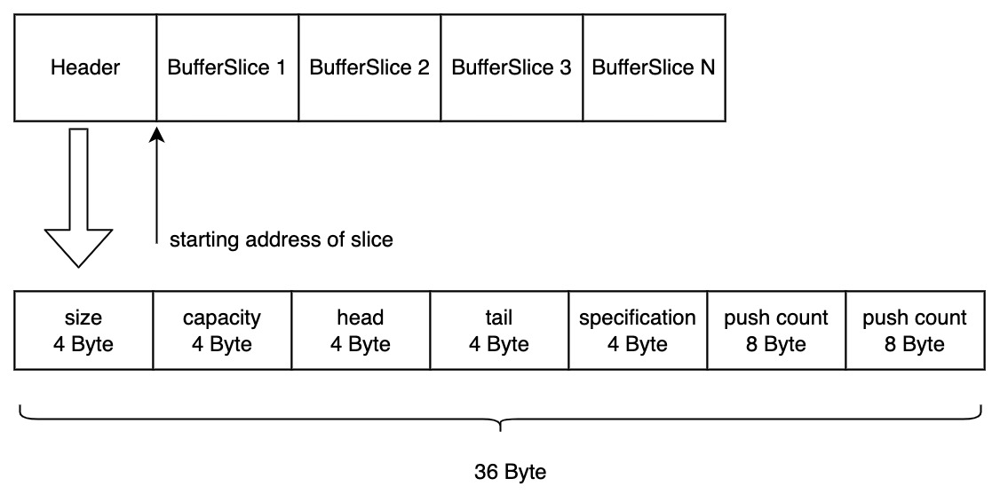
</body>
</html>


| 字段          | 解释                                                             |
| --------------- | ------------------------------------------------------------------ |
| size          | 该链表有多少个空闲未分配出去的 BufferSlice                       |
| capacity      | 该链表最多有多少个 BufferSlice                                   |
| head          | 链头节点在共享内存中相对于起始地址的偏移量，用于分配 BufferSlice |
| tail          | 链尾节点在共享内存中相对于起始地址的偏移量，用于回收 BufferSlice |
| specification | 每个 BufferSlice的容量，单位为 Byte                              |
| push count    | 该链表对于 BufferSlice 的总回收次数计数，用于监控                |
| pop count     | 该链表对于 BufferSlice 的总分配次数计数，用于监控                |

**BufferSlice**
<html>
<body>
    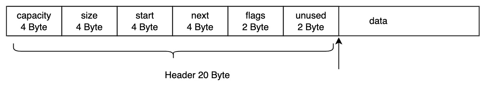
</body>
</html>

| 字段     | 解释                                                                                                                                                                  |
| ---------- | ----------------------------------------------------------------------------------------------------------------------------------------------------------------------- |
| data     | 实际承载的数据区域                                                                                                                                                    |
| capaticy | data 的能承载的容量，单位为 Byte                                                                                                                                      |
| start    | data 第一个字节相当于起始地址的                                                                                                                                       |
| next     | 多个 Slice 用链表组织，next 指向下一个 Slice 的偏移量(相对于共享内存的起始地址)                                                                                   |
| flags    | 标志位，2字节一共16个标志位。当前仅定义2个标志位：第一个标志位：nextFlag 标识 next 是否有效。第二个标志位：freeFlag 标识当前 BufferSlice 是否已被分配。（用于 debug） |
| unused   | 剩余2字节当前未定义                                                                                                                                                   |

通过映射一片连续的共享内存区域，可以得到 BufferManager、BufferList、BufferSlice 这三个数据结构。通过 BufferList 我们很容易完成跨进程的共享内存的分配和回收。


### 5.2 分配和回收

从一个例子出发，了解 BufferSlice 的分配和回收流程。

设：BufferList 中有3个 slice，每个  slice 的容量为1 KB。

**分配前**

BufferListHeader 中，head 指向链头 BufferSlice 1， tail 指向链尾 BufferSlice 3，size 为3。

<html>
<body>
    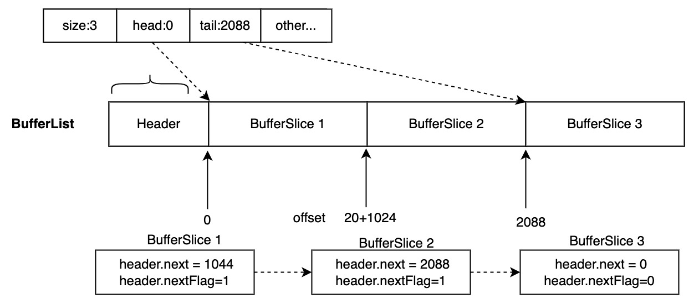
</body>
</html>

**分配后**

此时 BufferListHeader 中，head 指向链头 BufferSlice 2， tail 指向链尾 BufferSlice 3，size 变为2。BufferSlice 1已经被分配出去，不再指向 BufferSlice2。


<html>
<body>
    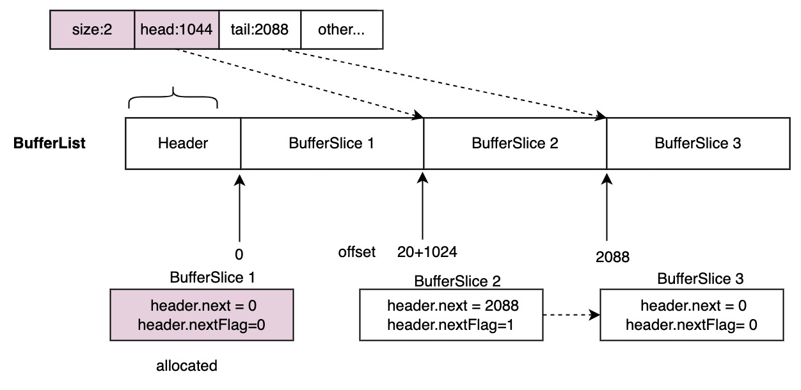
</body>
</html>

**回收后**

此时 BufferListHeader 中，head 指向链头 BufferSlice 2， tail 指向链尾 BufferSlice 1，size变为3。BufferSlice 3指向BufferSlice 1，bufferSlice 1被回收。


<html>
<body>
    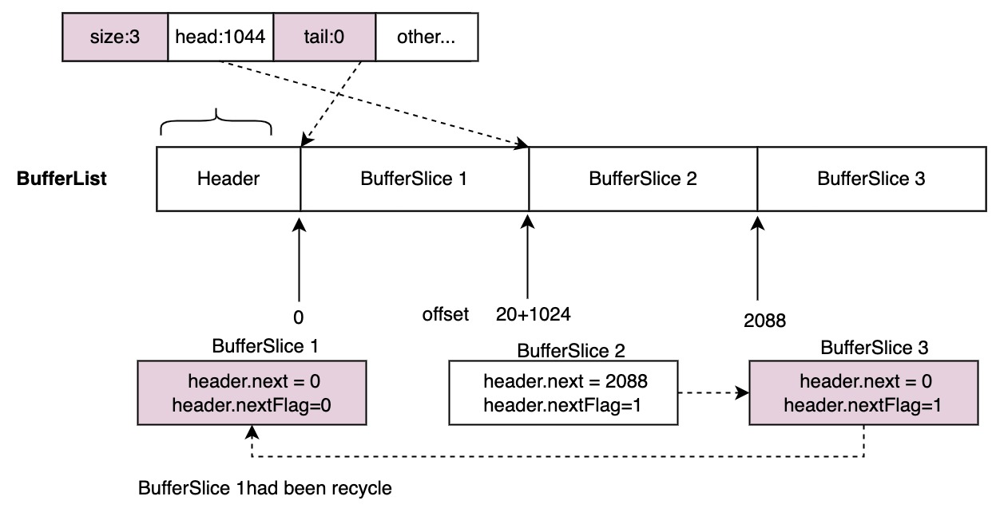
</body>
</html>

**关于竞态:**

1. 当 Buffelist 中的 BufferSlice 数量大于1时，分配和回收会分别操作不同的 BufferSlice，互不干扰。但并发分配，或并发回收会存在竞态。
   1. 分配操作需要通过对 BufferListHeader 中的`head`进行 CAS 操作避免并发冲突。
   2. 回收操作需要通过对 BufferListHeader 中的`tail`进行 CAS 操作避免并发冲突。
2. 当 Buffelist 中的 BufferSlice 数量等于1时，分配和回收操作在并发情况下会同时操作同一个 BufferSlice，产生冲突，此时禁止分配操作。
3. 操作 BufferListHeader 中的`size`时，需要使用编程语言提供的 atomic API 确保原子性。

**算法复杂度**

假设 BufferSlice 的数量为 N，分配和回收操作本身的算法复杂度为 O(1)，即使存在并发冲突，产生冲突的概率也非常低。每产生一次并发冲突需要进行一次 CAS 操作，一次分配或回收操作所进行 CAS 操作的最大次数(冲突次数)约等于 BufferSlice 的数量即O(N)。

### 5.3 清理

进程退出后共享内存的清理和最初映射共享内存的方式有关。

1. mmap 文件。此时共享内存的生命周期随内核不随进程，当进程崩溃时，对于无状态应用而言并没有时机去解除去共享内存的映射，需要第三方进程进行相关的清理。但一般地，只有当 IPC 的进程组在同一个时刻一起崩溃时才需要第三方进程来协助，否则一个进程崩溃，另外一个进程会收到连接关闭的事件，进而可以执行 unmap 解除对共享内存的映射。
2. mmap memfd。此时共享内存生命周期随进程，进程退出后，OS 会清理。

## 六、进程同步

Client 进程和 Server 进程需要存在某种同步机制，使得当一方写入数据时，另一方能够收到通知并进行处理。本章会描述一种高效的同步进制，面对高并发请求时，能够降低延迟同时有更好的性能。面对低频请求，不会引入增量延迟。

### 6.1 通知

使用 Client 与 Server 建立起的连接，发送章节3.2定义的 SyncEvent 来进行进程间的通知。当发送方将数据写入共享内存后，通过 SyncEvent 通知对端进行处理。

### 6.2 IO 队列

IO 队列是一个映射在共享内存中的数据结构，用于描述 IPC 的数据在共享内存中的位置等元信息，便于对端读取。

<html>
<body>
    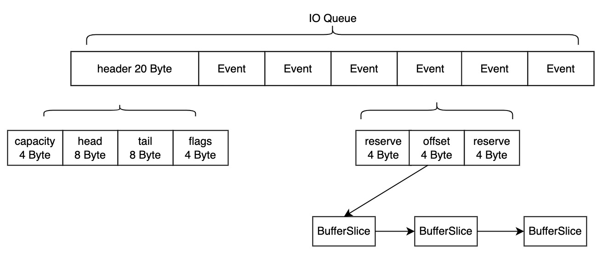
</body>
</html>

QueueHeader 用于描述和维护 IO 队列。

| 字段       | 解释                                                               |
| ------------ | -------------------------------------------------------------------- |
| capacity   | IO 队列最多能容纳多少个 Event                                      |
| head和tail | 单调递增，用于维护出队入队操作                                     |
| flags      | 每个 flag 1bit，当前仅定义一个 Working flag，详细作用在6.4节展开。 |

Event 用于描述IPC通讯的数据。

| 字段              | 描述                                                                                                                                                                                                                                                                                                                                                                                                                                                                                                           |
| ------------------- | -------------------------------------------------------------------------------------------------|
| offset| 数据在共享内存中第一个 BufferSlice 的起始地址，BufferSlice chain 在共享内存中是自描述的， **对端进程只需要4字节的 offset 就能找到在共享内存中要读取的所有数据** 。                                                                                                                                                                                                                                                                                                                                       |
| reserve| 预留了8字节进行自定义，用于在实现上，在构建编程接口时使用。举个例子：想要构建类 posix socket 语义的`连接`，此处称为`虚拟连接`，它不占用任何 OS 资源。 那么可以定义一个4字节的 ID 用于标识不同`虚拟连接`上的数据， 另外4个字节用于描述`虚拟连接`的状态(打开或关闭等)。那么ID=1，offset = 1024 ，status=1， 可以描述为 ID 为1的虚拟连接，在共享内存偏移1024的位置写入了若干数据，当前虚拟连接为打开状态(status=1)。 ID=1，offset=0，status=0，可以描述为关闭 ID 为1的虚拟连接，不再写入数据。 |

### 6.3 一次通讯

6.1节和6.2节已描述如何读取共享内存中的数据以及进程间的事件通知。本节描述一次通讯的过程。


<html>
<body>
    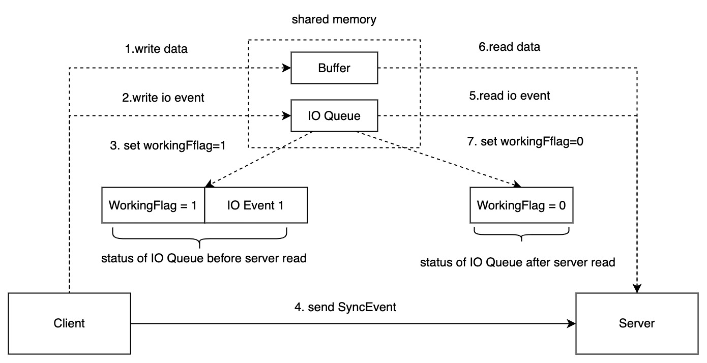
</body>
</html>

1. Client 将数据写入共享内存，得到第一个 BufferSlice 相对于共享内存的偏移量（offset）
2. Client 将 offset 包装成 IO event 写入 IO Queue
3. Client 设置 IO queue 的 workingFlag=1
4. Client 发送 SyncEvent 至 Server
5. Server 接收 SyncEvent 被唤醒，读取 IO Queue，得到 offset
6. Server 根据 offset 读取共享内存中的数据
7. 此时 IO Queue 已空，Server 设置 WorkingFlag=0

Server 给 Client 回复数据也类似上述过程，不同点仅在于 IO Queue 是隔离的。对于 Client 而言 SendQueue 相当于 Server 的 ReceiveQueue，Server 的 SendQueue 相当于 Client 的 ReceiveQueue。

### 6.4 批量收割 IO


<html>
<body>
    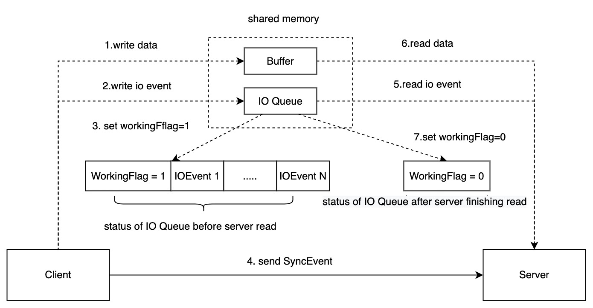
</body>
</html>

考虑在线并发场景，Client 会同时发起多个请求(写入多份数据)，每个请求相当于一个 IO Event。第一个请求会设置 workingFlag = 1 并发送 SyncEvent。那么在 Server 处理完 IO Queue 之前，Client 后续发送的所有请求，可以通过 workingFlag = 1 知晓 Server 正在处理 IOEvent，故都不需要再发送 SyncEvent 通知 Server。

以此实现一次 SyncEvent，批量收割 IO。

## 七、错误回退

本章描述如何处理共享内存不足时的场景。

### 7.1 共享内存耗尽

<html>
<body>
    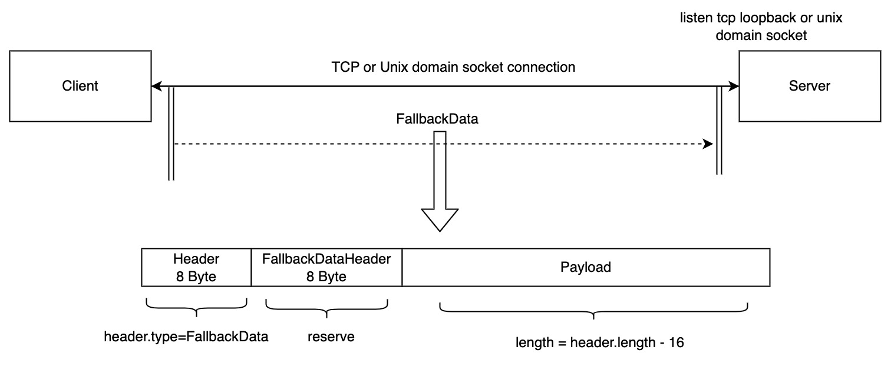
</body>
</html>

当共享内存已耗尽时，新的数据不再通过共享内存通讯。借助 Client 和 Server 已建立起的连接，`TCP loopback`或`unix Domain Socket`。并且由于单连接的 socket buffer 有限，也能够起到反压的作用，缓解 Server 压力。

1. 消息头中的 type 设置为 FallbackData。
2. FallbackDataHeader 为预留的8字节，用于描述 payload 的元信息，对标 IO event 中预留的8字节。比如：用于描述虚拟连接的 ID 和状态。
3. pyaload 为实际传输的数据。

### 7.2 IO 队列满载

IO 队列满载说明 Server 的压力山大，此时 Client 阻塞直至 IO 队列有空闲位置。相当于反压，类似于 unix socket buffer 填满时，写入操作要么失败（EAGAIN），要么阻塞。不宜引入过多操作增加复杂性。

## 八、热升级

热升级是指对 Server 进程代码更新升级时不会影响 Client 写入数据。热升级的技术选型非常多，考虑到 IPC 以 lib 形式提供服务，已嵌入至应用进程中，那么可以选择简单的应用层热升级。

<html>
<body>
    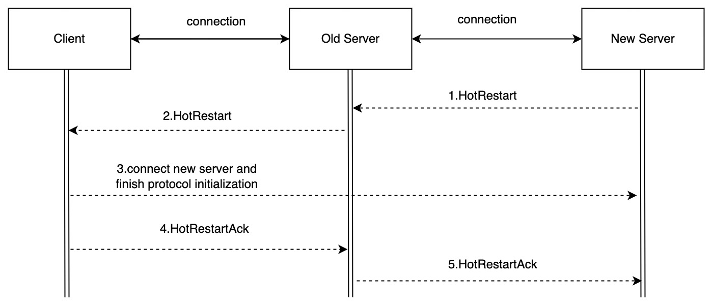
</body>
</html>

1. New Server 启动完成后，连接 Old Server 并发送 HotRestart 消息。
2. Old Server 收到 HotRestart 消息后，向所有 Client 发送 HotRestart 消息。
3. Client 收到 HotRestart 消息后，连接 New Server 并完成协议初始化，同时新的请求应发至 New Server。
4. 当 Client 与 OldServer 的**依赖解除**后，Client 向 OldServer 发送 HotRestartAck。Client 与 OldServer的**依赖**与协议上层提供的编程接口相关，此处不做约束，应由lib自行处理。举个例子，章节6.2中提到了**虚拟连接**的概念，那么这儿的**依赖解除**就是 Client 与 Old Server 的所有虚拟连接关闭，并且不再有新的虚拟连接产生。
5. 当与 OldServer 连接的所有 Client 都回复 HotRestartAck 之后，Old Server 向 NewServer 发生 HotRestartAck，最后退出，热升级完成。

## 九、一些设计考量

**关于进程同步机制的选择**

Linux下，生产环境常用的高性能的进程同步机制有`TCP loopback`、`Unix domain socket`、`event fd`等。`event fd`benchmark 的性能会略好，但 **跨进程传递 fd 会引入过多复杂性** ，其带来的**性能提升在 IPC 上并不明显**。基于此，复用 Client 与 Server 建立起的连接会降低复杂性，对一些没有 event fd 的系统也能使用。

此外，该方案适用于在线场景，对实时性的要求比较高。对于离线场景，使用高间隔的 sleep，轮询 IO 队列也是个不错的选择，但注意 sleep 本身也需要系统调用，并且开销大于通过连接发送 SyncEvent。

**关于错误回退**

也许可以通过运行时动态新增映射共享内存预期来缓解共享内存不足的问题，但又会为管理带来更多的 **复杂性** 。一个应用场景的 workload 是比较固定的，现在计算机的内存资源不再紧缺，可以在一开始就分配比较大的一块共享内存供后续使用。共享内存的 buffer 大小有点类似于 unix socket buffer，当其填满时说明 server 已经过载，无法及时处理并释放，需要缓缓。此时再分配更多的共享内存也无济于事。

**关于热升级**

Server 热升级有标准的 listener fd 热迁移方案，但其强调无损无感知。而共享内存通信以 lib 提供服务，已嵌入应用。在应用层进行热升级相对 listener fd 热迁移会简洁得多。

**关于引入****IO****队列**

主要为了批量收割 IO，避免频繁地在连接上收发 SyncEvent，此过程带来的 system call 对性能的影响不可忽略。

